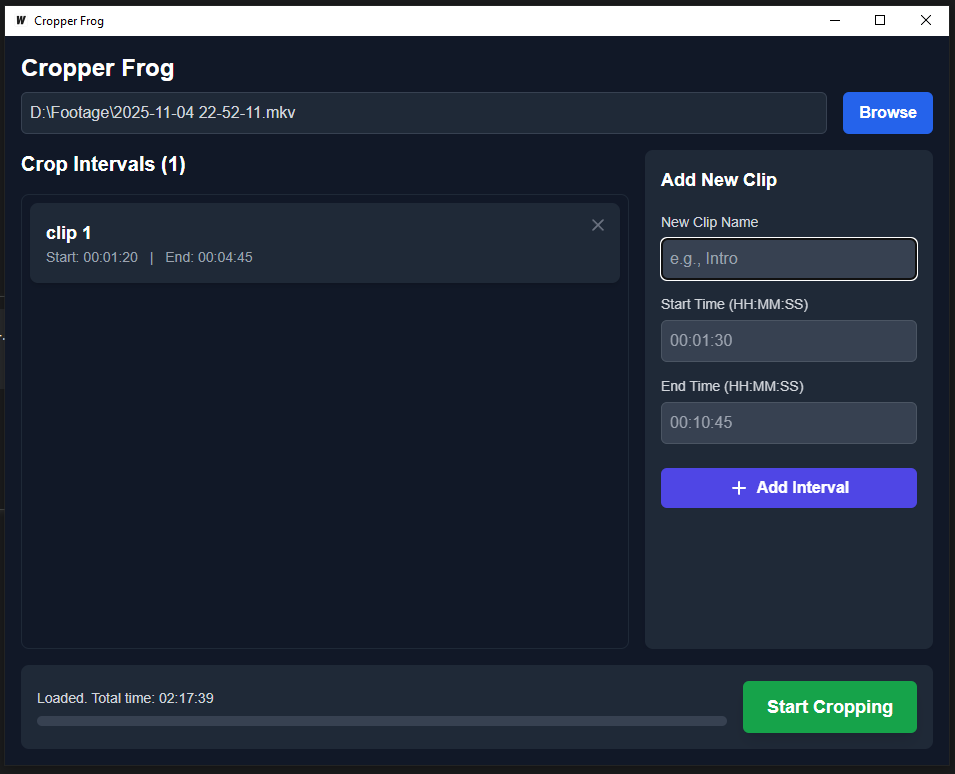

# Cropper Frog

Cropper Frog is a simple, stable, and reliable desktop application built for one purpose: to extract multiple, precisely-timed video clips from a single, large video file.

It is designed to be fast, lightweight, and avoid re-encoding, providing "lossless" high-speed processing.

-----

## How to Use (Step-by-Step)

A simple tutorial for using the app.

1.  **Prerequisite:** Ensure **FFmpeg** is installed and accessible. (See the **Installation** section below).
2.  **Load Video:** Click the **Browse** button to select a large video file. The app will load it and display its total time (e.g., `Loaded. Total time: 02:17:39`).
3.  **Add a Clip:**
      * In the "Add New Clip" form, give your clip a unique name (e.g., `Clip_Intro`). This will be the name of the final file.
      * Enter a **Start Time** (e.g., `00:01:30`).
      * Enter an **End Time** (e.g., `00:10:45`).
      * Click the **+ Add Interval** button.
4.  **Build Your Queue:** Your clip will appear in the "Crop Intervals" list. Repeat Step 3 to add as many clips as you need. If you make a mistake, just click the `x` on any clip in the list to remove it.
5.  **Start Cropping:** When your queue is ready, click the green **Start Cropping** button.
6.  **Select Output Folder:** A new dialog will ask you to choose a folder where your new clips will be saved.
7.  **Monitor Progress:** The app will begin processing your clips one by one. The UI **will not freeze**. You can watch the status message, the overall progress bar, and the ETA (Estimated Time Remaining).
8.  **Done:** When finished, the status will change to "All clips created successfully\!". You can now find all your new video files in the output folder you selected.

### UI

-----

## Installation & Requirements

The application relies on the external tool **FFmpeg** to function. You must install it before using the app.

### For End-Users (Recommended)

This is for users who just want to use the `CropperFrog.exe` file.

**Requirement:** **FFmpeg**

The easiest way to install FFmpeg on Windows is by using **Winget**.

1.  Open **PowerShell** or **Command Prompt**.

2.  Run the following command. This installs the popular "Gyan" build of FFmpeg and adds it to your system PATH.

    ```sh
    winget install ffmpeg
    ```

3.  After the installation is complete, **restart `CropperFrog.exe`**. The app will now be able to find and use FFmpeg.

*Alternative (Manual):* You can download `ffmpeg.exe` and `ffprobe.exe` from the [FFmpeg website](https://www.gyan.dev/ffmpeg/builds/) and place them in the **same folder** as `CropperFrog.exe`.

-----

### For Developers

This is for users who want to build the project from the source code.

**Requirements:**

1.  **FFmpeg** (Video/audio processing)
2.  **Go (Golang)** (Backend)
3.  **Node.js (LTS)** (Frontend dependencies)

You can install all three required dependencies using **Winget**. Open PowerShell and run the following commands:

```sh
# 1. Install FFmpeg (Gyan build)
winget install --id=Gyan.FFmpeg -e

# 2. Install Go (Golang)
winget install --id=GoLang.Go -e

# 3. Install Node.js (Long Term Support)
winget install --id=OpenJS.NodeJS.LTS -e
```

After installing the dependencies, you can run the project:

```sh
# Install frontend node modules
npm install

# Run in development mode
wails dev

# Build the final production executable
wails build
```

-----

## Main Features

  * **File Handling:** Loads a single video file at a time, supporting all common formats (MP4, MKV, MOV, AVI, WEBM).
  * **Metadata Reading:** Instantly reads the video's total duration upon loading without blocking the UI.
  * **Crop Queue Management:** Add, view, and remove multiple clips to a processing queue.
  * **Robust (Backend) Validation:**
      * Supports flexible time formats (accepts `HH:MM` and `HH:MM:SS`).
      * Rejects clips with invalid logic (e.g., Start \> End).
      * Rejects clips where the End Time is past the video's total duration.
  * **High-Performance Processing:**
      * **No Freezing\!** All video processing runs on a background thread (goroutine), allowing the UI to remain 100% responsive.
      * **Extremely Fast:** Uses `ffmpeg` with "stream copy" (`-c copy`) for a high-speed, lossless process.
  * **Real-Time Feedback:** Includes a live status label, a queue progress bar, and an ETA (Estimated Time Remaining).

-----

## Technology Stack

  * **Backend:** **Go (Golang)**
  * **GUI Framework:** **Wails v2** (to bridge Go with the web frontend)
  * **Frontend:** **Svelte** + **Vite** + **Tailwind CSS**
  * **Video Engine (Dependency):** **FFmpeg**